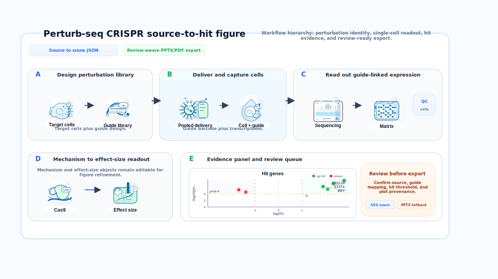
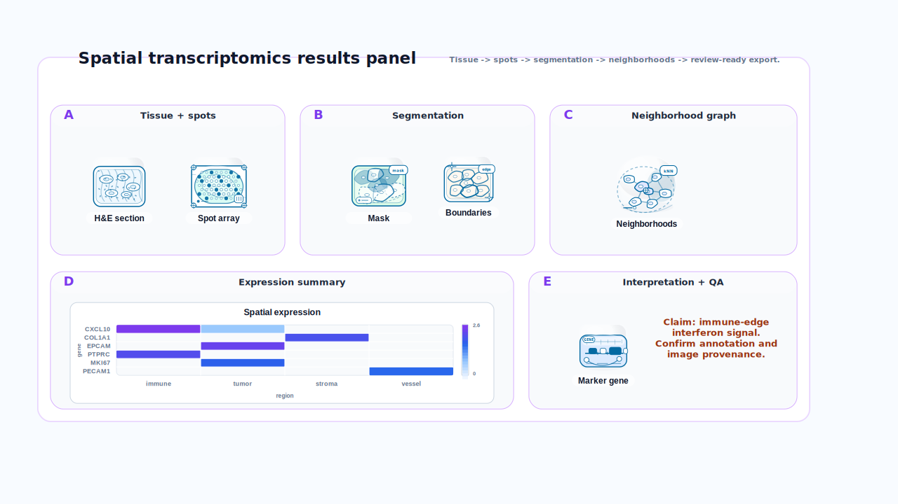
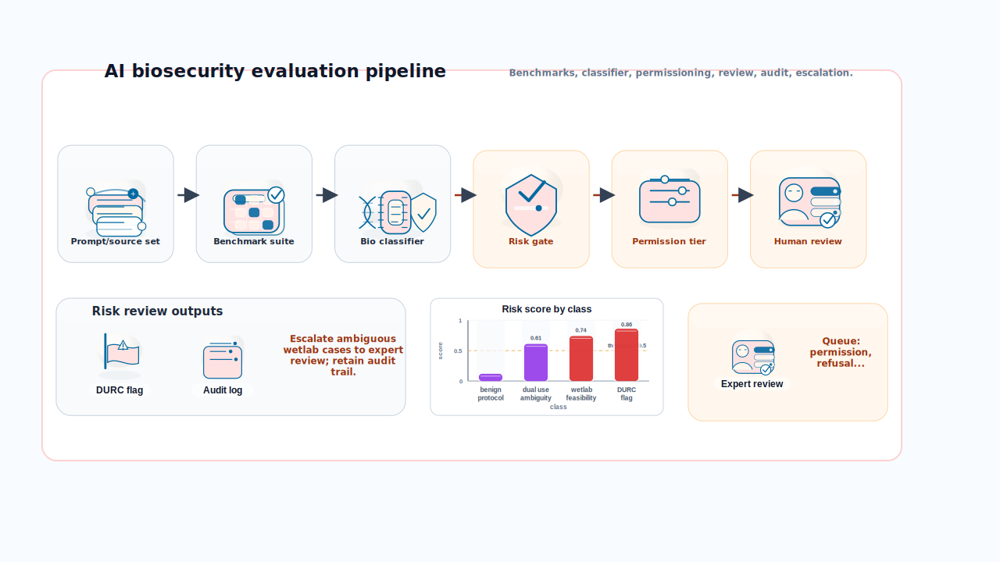

# Scientific Image

[](https://github.com/jang1563/Scientific_image/actions/workflows/ci.yml)

Local-first scientific visual communication MVP: a structured SVG-first editor for biology and AI diagrams, figures, plots, posters, and premium slide decks.

The repo is intentionally usable with only Node 24 in this environment. The current MVP core runs without installing packages and keeps structured scene JSON as the canonical artifact.

## Project Brief

Scientific Image is a portfolio-grade local product prototype for scientific visual communication. It combines a static web workspace, structured SVG scientific asset library, export-aware scene graph, local API, and MCP server so both humans and agents can create editable biology/AI figures from the same source of truth.

What this repo is meant to demonstrate:

- Product engineering for a BioRender-like local-first workflow, with editable scene JSON instead of opaque screenshots.
- Scientific design-system work: workflow packs, premium asset metadata, style profiles, provenance, review queues, and export QA.
- Agent-facing infrastructure: compact asset indexes, insert-ready recommendations, deterministic workflow figure creation, and MCP resources for Codex/Claude-style clients.
- Portfolio discipline: public examples, reproducible metrics, CI checks, and a public-readiness audit that guards against stale claims or private material.

## 30-Second Reviewer Path

1. Look at the generated SVG examples below; they are produced from editable scene nodes, not screenshots.
2. Skim the portfolio metrics and the [Repository Index](docs/REPOSITORY_INDEX.md).
3. Run `node --test tests/*.test.ts` and `node scripts/public-readiness-audit.ts`.
4. Start the local workspace with `node scripts/serve-static.ts apps/web 4173`.
5. Inspect the agent path with `node scripts/agent-acceptance-smoke.ts`.

## Copy-Paste Reviewer Commands

No package install is required in the intended Node 24 environment. Run the verification path first:

```bash
node --test tests/*.test.ts
node scripts/portfolio-metrics.ts
node scripts/public-readiness-audit.ts
node scripts/agent-acceptance-smoke.ts
```

Then start the local static workspace:

```bash
node scripts/serve-static.ts apps/web 4173
```

Open one of the editable public demos:

- `http://127.0.0.1:4173/?demo=perturb-seq-workflow`
- `http://127.0.0.1:4173/?demo=spatial-results-panel`
- `http://127.0.0.1:4173/?demo=ai-biosecurity-pipeline`

## Why This Is Technically Interesting

- One canonical scene graph drives the web workspace, API, MCP tools, visual examples, and SVG/PDF/PPTX/DOCX exports.
- Assets are addressable by `assetId`, `workflowPack`, semantic slot, style profile, and editable part metadata, so agents can create diagrams without emitting raw SVG.
- Export QA names exact fallback assets and unresolved review items instead of hiding fidelity loss behind screenshots.
- The public examples are regenerated deterministically in CI, keeping README visuals tied to real code.

## Portfolio Snapshot

- `496` browseable assets in the local gallery: `466` curated structured assets plus `30` realistic fixtures.
- `429` signature/hero assets across `18` workflow packs and `77` templates.
- Metrics are recomputed from code with `node scripts/portfolio-metrics.ts`.
- Local-first web workspace, API, and MCP server share the same scene graph.
- Agent-ready contract: agents use `workflowPack`, `templateId`, `assetId`, `styleProfile`, semantic slots, and editable appearance overrides instead of raw screenshots.
- Export-aware pipeline: SVG/PDF/PPTX/DOCX paths emit exact fallback and provenance warnings.
- Verification target: `node --test tests/*.test.ts` and `node scripts/public-readiness-audit.ts`.

For a reviewer-oriented Repository Index, see [docs/REPOSITORY_INDEX.md](docs/REPOSITORY_INDEX.md). For MCP/Codex/Claude usage, see [docs/AGENT_QUICKSTART.md](docs/AGENT_QUICKSTART.md). For a metrics-based Portfolio Scorecard, see [docs/PORTFOLIO_SCORECARD.md](docs/PORTFOLIO_SCORECARD.md). For public release rules, see [docs/PUBLIC_RELEASE_CHECKLIST.md](docs/PUBLIC_RELEASE_CHECKLIST.md).

For a claim-by-claim Reviewer Evidence Map, see [docs/REVIEWER_EVIDENCE_MAP.md](docs/REVIEWER_EVIDENCE_MAP.md). It links each portfolio claim to the exact files, tests, commands, and public demos a reviewer can inspect.

For the MCP/agent proof path, see [docs/AGENT_DEMO_EVIDENCE.md](docs/AGENT_DEMO_EVIDENCE.md). It maps the smoke test to agent resources, compact asset indexing, workflow figure generation, review validation, and export QA.

## Visual Examples

These are synthetic public examples generated from structured scene nodes, not screenshots or private source material. Regenerate them with `node scripts/generate-public-examples.ts`.

| Perturb-seq workflow | Spatial transcriptomics panel | AI biosecurity pipeline |
| --- | --- | --- |
|  |  |  |

See [docs/PUBLIC_EXAMPLE_GALLERY.md](docs/PUBLIC_EXAMPLE_GALLERY.md) for what each example demonstrates, which template generated it, and which local URL opens the editable scene.

What to look for:

- The examples are generated from workflow templates and premium asset IDs, not manually pasted SVG screenshots.
- The same scene nodes can be opened in the web workspace through the public demo URLs above.
- Review/export warnings remain part of the delivery path, so PPTX/DOCX limitations are visible instead of hidden.

## Architecture Map

| Layer | Responsibility | Where to inspect |
| --- | --- | --- |
| Scene graph | Canonical project/page/node schema, validation, provenance, claim status, transforms, and deterministic edits | `packages/scene/`, `tests/scene.test.ts` |
| Asset system | Structured SVG biology/AI assets, workflow packs, semantic search, style profiles, realistic fixtures, and visual QA | `packages/assets/`, `tests/assets.test.ts` |
| Web workspace | Static local editor for browsing assets, launching public demos, editing scenes, reviewing delivery state, and exporting local artifacts | `apps/web/`, `tests/web-ui.test.ts` |
| Agent/API layer | Local HTTP and MCP surfaces for source import, asset recommendation, workflow figure creation, review validation, and export QA | `apps/api/`, `packages/mcp/`, `packages/agent/`, `tests/api-mcp.test.ts` |
| Export layer | SVG/PDF/PPTX/DOCX exports with named fidelity fallbacks and review-aware warnings | `packages/export/`, `tests/export.test.ts` |
| Deck/plot layer | Deck outline metadata, source documents, review queue, agent trace, CSV/TSV parsing, and editable plot specs | `packages/deck/`, `packages/plotting/`, `tests/deck.test.ts`, `tests/plotting.test.ts` |

The same structured scene JSON moves through all layers. For a fuller file-by-file map, see [docs/REPOSITORY_INDEX.md](docs/REPOSITORY_INDEX.md).

## Local Workspace And Servers

Use the copy-paste reviewer commands above for verification. For local inspection, start only the surface you need.

Web workspace:

```bash
node scripts/serve-static.ts apps/web 4173
```

Then open `http://127.0.0.1:4173`.

Optional API server:

```bash
node apps/api/src/server.ts
```

Optional MCP server:

```bash
node packages/mcp/src/server.ts
```

The right-side Insert panel includes a `Public demos` launcher for the same Perturb-seq, spatial transcriptomics, and AI biosecurity examples shown above.
Direct local demo links also work after the static server is running:

- `http://127.0.0.1:4173/?demo=perturb-seq-workflow`
- `http://127.0.0.1:4173/?demo=spatial-results-panel`
- `http://127.0.0.1:4173/?demo=ai-biosecurity-pipeline`

## Premium Deck Flow

1. Paste markdown notes, paper summary text, or extracted PDF text into the source panel.
2. Import the source.
3. Draft an outline.
4. Approve and generate editable slides.
5. Resolve the review queue for claims, provenance, layout, accessibility, and export warnings.
6. Export structured JSON, deck SVG, current-slide PNG, or use the API/MCP exporters for PPTX/PDF.

Important API routes:

- `GET /agent/manifest`
- `GET /agent/resources`
- `GET /agent/resources/:resourceId`
- `GET /assets?query=...&category=...&role=...`
- `GET /assets/:assetId`
- `GET /assets/:assetId/render?variant=...`
- `POST /assets/recommend`
- `POST /projects/:id/sources`
- `POST /projects/:id/deck/outline`
- `POST /projects/:id/deck/outline/approve`
- `POST /projects/:id/deck/generate`
- `POST /projects/:id/deck/validate`
- `GET /projects/:id/deck/review`
- `GET /projects/:id/deck/review-summary`
- `POST /projects/:id/deck/review/resolve`
- `PATCH /projects/:id/deck/review/:reviewItemId`
- `GET /projects/:id/export/pptx`
- `GET /projects/:id/export/pdf`
- `POST /exports/:format` for transient scene JSON export without saving to the API data directory

Important MCP tools:

- `get_agent_manifest`
- `read_agent_resource`
- `search_assets`
- `get_asset`
- `render_asset_preview`
- `recommend_assets_for_slide`
- `insert_premium_asset`
- `import_source`
- `create_deck_outline`
- `revise_deck_outline`
- `generate_slide_from_brief`
- `generate_deck_from_outline`
- `apply_scene_operations`
- `validate_deck`
- `list_review_items`
- `summarize_review_queue`
- `resolve_review_item`
- `resolve_review_items`
- `export_deck`

Important MCP resources:

- `scientific-image://agent/manifest`
- `scientific-image://agent/quickstart`
- `scientific-image://agent/workflow-recipes`
- `scientific-image://agent/agent-cookbook`
- `scientific-image://agent/demo-perturb-seq-crispr`
- `scientific-image://agent/asset-index-compact`
- `scientific-image://agent/client-configs`
- `scientific-image://agent/review-export-checklist`

## Agent Proof Path

For a copy-pasteable MCP/API flow, start with [docs/AGENT_QUICKSTART.md](docs/AGENT_QUICKSTART.md). For the reviewer-facing proof map, see [docs/AGENT_DEMO_EVIDENCE.md](docs/AGENT_DEMO_EVIDENCE.md).

Quick local proof:

```bash
node scripts/agent-acceptance-smoke.ts
node scripts/agent-acceptance-smoke.ts --workflow-pack perturb-seq-crispr
```

The smoke follows the same loop an agent should use: read MCP resources, inspect tools, choose a workflow pack, create an editable workflow figure, validate review/export QA, and verify SVG/PDF/PPTX output.

Claude Code, Codex, and other MCP clients should connect to the local stdio server:

```bash
node packages/mcp/src/server.ts
```

Recommended first calls are:

1. `resources/list`
2. `resources/read` for `scientific-image://agent/manifest`
3. `resources/read` for `scientific-image://agent/agent-cookbook`
4. `resources/read` for `scientific-image://agent/demo-perturb-seq-crispr`
5. `tools/list`

Agents should prefer workflow-pack templates and asset IDs over raw SVG strings, keep scene JSON as the canonical artifact, run review/export QA before delivery, and surface exact PPTX fallback assets when Office export cannot preserve native editability.

The web workspace includes a Delivery panel that mirrors this gate for humans. It keeps scene JSON as the canonical source export, allows SVG/PNG local exports, and uses the local API for PDF/PPTX delivery exports when `node apps/api/src/server.ts` is running.

## Premium Asset System

The local gallery contains `496` browseable assets: `466` curated structured visual assets plus `30` realistic editorial fixtures.

- `386` biology assets across cells/tissues, genomics, perturbation, assays, spatial imaging, molecules/pathways, model systems, pathogens/biosafety, clinical/translational, drug discovery, protein engineering, synthetic biology, microscopy, lab automation, organ systems, methods, and space biology.
- `80` AI assets across data/model systems, LLM/RAG/agents, evaluation, safety/permissioning, biosecurity workflows, and governance/monitoring.
- Every asset includes semantic metadata, aliases, tags, provenance, variants, editable parts, recommended size, and a reusable render family.
- The renderer is used by web previews, scene SVG export, API rendering, and MCP previews.

## Public Repo Hygiene

Generated files under `output/` and `.playwright-cli/` are local QA artifacts and are ignored by git. Do not commit private notes, internal chat logs, application-specific personal context, API keys, proprietary source documents, or generated decks containing non-public data. Run:

```bash
node scripts/public-readiness-audit.ts
```

before sharing the repository or changing GitHub visibility.

## License And Reuse

This repository is source-available for portfolio review. It is not currently released under an open-source license. See [LICENSE](LICENSE) before copying, redistributing, hosting, or incorporating the code, assets, templates, or generated examples elsewhere.

## V1 Boundaries

This MVP is single-user and local-first. Sync, collaboration, team libraries, marketplace, AnnData/h5ad, spatial-native readers, and full hosted React/Next deployment are extension points, not implemented v1 features.
